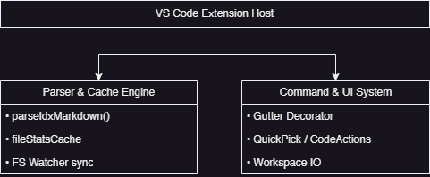

# IDX Technical Manual

This guide describes the structural architecture, module layout, internal algorithms, optimization behaviors, and technical specifications of the
IDX VS Code Extension codebase.

---

## 🏗️ 1. Architecture Overview

IDX is designed as a standalone, zero-dependency VS Code extension optimized for fast startup and low resource overhead. It compiles into a single
CommonJS bubble via `esbuild`.

The implementation flow is divided into three key systems:




---

## 🧠 2. Core Modules & Systems

### A. Non-blocking In-Memory Statistics Cache (`fileStatsCache`)
To prevent heavy disk IO bottlenecks when a user typing in `idx.md` triggers parser passes, IDX stores filesystem check states in memory:
- **The Problem**: Executing recursive `fs.existsSync` or `fs.statSync` inside 300ms debounce typing loops causes noticeable editor stutters in larger workspaces.
- **The Solution**: An in-memory cache map stores:
  ```typescript
  const fileStatsCache = new Map<string, { exists: boolean; isFolder: boolean }>();
  ```
  Path lookups are handled instantly. If a path check misses, a single synchronous fallback initializes the cache entry.
- **FS Watcher Synchronization**:
  We bind a workspace filesystem watcher to monitor creation, deletion, and volume edits:
  ```typescript
  const watcher = vscode.workspace.createFileSystemWatcher('**/*');
  watcher.onDidCreate(uri => {
    fileStatsCache.delete(uri.fsPath);
    updateAllVisibleDecorations(manager);
  });
  ```
  This strategy achieves zero file-sync overhead during idle coding periods while responding to changes on disk immediately.

### B. Indentation Tracking & Contextual Hierarchy Parser
The parser `parseIdxMarkdown` processes files line-by-line while tracking folder layers:
1. **Scope Parsing**: Tracks markdown heading layers (`#`, `##`, `###`). Scopes clear folder indentations to prevent context bleeding.
2. **Indentation Sizing**: Calculates the exact spacing leading a line (counting tab sizes as `4` spaces).
3. **Folder Context Stack**:
   - If a path is verified to be a folder, it is pushed onto `folderStack: Array<{ indentation: number, resolvedPath: string }>` alongside its indent-signature.
   - On succeeding lines, the stack is popped until the current indentation exceeds that of the parent folder. This maintains strict directory scoping without
   requiring complex configurations.

---

## 🔎 3. Core Algorithm: Candidate Resolve Logic

```typescript
// How IDX parses and resolves raw strings (e.g. "extension" to "/work/src/extension.ts")
const candidates = [cleanedFilepath];
if (!cleanedFilepath.includes('.')) {
  const commonExtensions = ['.ts', '.tsx', '.js', '.jsx', '.json', '.css', '.html', '.md'];
  for (const ext of commonExtensions) {
    candidates.push(cleanedFilepath + ext);
  }
}
```
For each candidate:
1. Checked for **Absolute Pathing**.
2. Evaluated relative to the **Current Nested Stack Directory**.
3. Checked relative to the **Workspace Folder Root**.
4. First match wins, defining both the exact path on disk and updating the cache status.

---

## 🛰️ 4. Commands Integration

Every command is registered through the activation context subscriptions:

1. **`idx.openIdx`**: Automatically locates `idx.indexFilename` in settings. If absent, triggers an editor picker to create a pristine `idx.md` template.
1. **`idx.update`**: Finds all workspace files omitting `excludePatterns`, contrasts them with parsed references inside the current index, and appends
  the diff under `# New Files` / `# Missing Files`.
1. **`idx.gotoFile`**: Performs a localized workspace stat check. If a folder, yields an async `QuickPick` featuring customized categories
  (Open Files vs. Closed Files) with custom live file hovers.
1. **`idx.toggleCheckbox`**: Focuses the current active line, localizes brackets syntax `[ ]` or `[x]`, and mutates the character index via `vscode.WorkspaceEdit`.
1. **`idx.createMissing`**: Orchestrates parent directory recursion and touches files or creates empty folders.
1. **`IdxCodeActionProvider`**: Listens for cursor positions in Markdown lines and registers context-appropriate action payloads
  (such as checkbox togglers and rapid-genesis fixes).

---

## 🔧 5. Workspace Build & Configuration

The build stack consists of:
- **Bundler**: `esbuild` using the parameters defined in `esbuild.config.js` or `build.js` targeting Node v16 for clean, optimized production deliverables.
- **Transpilation**: TypeScript definitions paired with a custom `tsconfig.json` set to generate CommonJS modules.
- **Linter**: Built-in lint script validation tests ensuring zero compiler or formatting errors exist across codebase edits.
